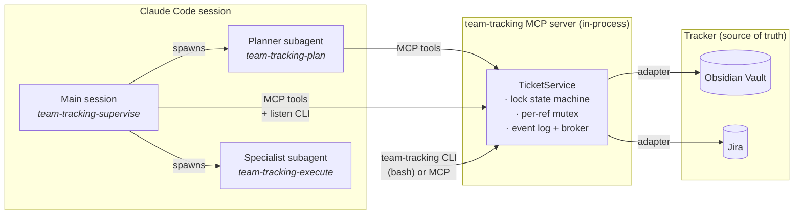

# team-tracking-plugin


A Claude Code plugin that gives an orchestrator and its specialist subagents a shared, durable view of the work they're driving. Tickets live in your real tracker (Obsidian Kanban or Jira); the plugin's MCP server is the contract between Claude and the board.

See [`examples/`](examples/) for a browseable snapshot of an orchestrator-driven board.

## How it works

The plugin splits an end-to-end orchestration cycle across three Claude contexts: a **main session** that supervises in-flight work, a **planner subagent** that reads the board and decomposes intent into tickets, and **specialist subagents** that execute one subtask each under a lock. The MCP server is in-process inside the main session and the tracker (an Obsidian vault or Jira) is the durable source of truth — every state change lands there as an event before any caller sees it.



A typical cycle, end to end:

```mermaid
sequenceDiagram
    autonumber
    participant U as User
    participant O as Main session
    participant P as Planner subagent
    participant T as MCP server / Tracker
    participant S as Specialist subagent

    U->>O: "Plan and execute X"
    O->>P: spawn (PRD + project)
    P->>T: list_board
    P->>T: create_ticket(s) + update_ticket(parent → Todo)
    P-->>O: dispatch_list JSON ({ ref, role, brief }[])
    Note over O: brief.startsWith("Use skill team-tracking-execute. Run via bash: team-tracking acquire …")

    loop each entry in order
      O->>S: spawn (verbatim brief)
      S->>T: bash: team-tracking acquire
      T-->>S: lock_token + system_addendum (inlined skill body)
      S->>S: do the work
      S->>T: bash: team-tracking checkpoint (per commit)
      S->>T: bash: team-tracking release Done
      T-->>O: status_change event (via background `listen`)
    end

    Note over O,T: On Blocked, the main session re-spawns the planner with blocker context; planner returns a fresh dispatch_list and the loop continues.
```

Two design decisions that fall out of this shape:

- **The lock contract is the audit trail.** Specialists can't `commit_checkpoint`, `report_progress`, or `release_ticket` without first calling `acquire_ticket`. Every acquire/checkpoint/release is an event on the ticket's append-only log; the visible scalar fields (`update`, `progress_summary`, `lock`) are read caches over that log.
- **The protocol is delivered, not assumed.** `acquire_ticket` returns `system_addendum` — the literal `team-tracking-execute` SKILL.md body inlined under a `--- team-tracking-execute ---` divider. Specialists receive the protocol on first acquire regardless of what their dispatching session put in the brief and regardless of which MCP tools the host granted them. The CLI is bash-callable, so the entire executor surface works with only `bash` granted.

## What it ships

- **MCP server** with 14 tools across reads (`list_board`, `get_ticket`, `list_children`), ticket CRUD (`create_ticket`, `update_ticket`), the lock state machine (`acquire_ticket`, `commit_checkpoint`, `release_ticket`, `report_progress`), the audit log (`append_log`), the steering channel (`post_message`, `read_messages`), and the unified event log (`read_events`, `read_project_events`).
- **Two adapters today**: Obsidian Kanban (file-backed, local vault) and Jira (cloud, with custom-field or fenced-section storage).
- **Slash commands**: `/team-tracking-mcp:init`, `/team-tracking-mcp:status`, `/team-tracking-mcp:reconfigure`.
- **One subagent**: [`team-tracking-planner`](plugins/team-tracking-mcp/agents/team-tracking-planner.md) — the planner. Spawned by the main session per cycle (fresh plan or re-plan on Blocked); reads the board, decomposes, creates tickets, returns a structured `dispatch_list`.
- **CLI** (`team-tracking <subcommand>`) for the executor protocol and the listener: `acquire`, `checkpoint`, `release`, `progress`, `log`, `message`, `listen`. Self-contained — loads `.team-tracking/config.json` and the adapter directly. Specialists with only `bash` granted can run the full protocol.
- **Six skills** that teach Claude how to use the system:
  - [`team-tracking-orchestrate`](plugins/team-tracking-mcp/skills/team-tracking-orchestrate/SKILL.md) — the router. Routes the main session to the planner subagent for planning, and to `team-tracking-supervise` for in-flight steering.
  - [`team-tracking-plan`](plugins/team-tracking-mcp/skills/team-tracking-plan/SKILL.md) — loaded by the planner subagent. Board reads, decomposition, hierarchy, priority.
  - [`team-tracking-supervise`](plugins/team-tracking-mcp/skills/team-tracking-supervise/SKILL.md) — loaded by the main session. Listener, drift signals, steering channel, recovery.
  - [`team-tracking-execute`](plugins/team-tracking-mcp/skills/team-tracking-execute/SKILL.md) — the specialist's protocol. Acquire → checkpoint → release; how to escalate when a subtask is too complex. Inlined verbatim into `system_addendum`.
  - [`team-tracking-usage`](plugins/team-tracking-mcp/skills/team-tracking-usage/SKILL.md) — tool reference (the 14 tools, ticket types, event log, lock state machine, typed errors).
  - [`team-tracking-obsidian-kanban`](plugins/team-tracking-mcp/skills/team-tracking-obsidian-kanban/SKILL.md) — adapter quirks for the Obsidian-backed tracker (file layout, card-eligibility rule, sub-bullet rendering, auto-flip).

## Install

Requires Node 20+ and pnpm 10+. The cleanest way to get pnpm on a fresh machine is corepack (ships with Node, no sudo):

```bash
corepack enable
corepack prepare pnpm@latest --activate
```

Then clone and build:

```bash
git clone https://github.com/RazvanRotaru/team-tracking-plugin.git
cd team-tracking-plugin
pnpm install
pnpm build
```

`pnpm build` must complete before installing into Claude Code — `plugin.json` points the MCP server at `mcp-server/dist/index.js`, which doesn't exist until you build.

Register with Claude Code using its marketplace flow (`/plugin install` takes a *plugin@marketplace* identifier, not a path). The repo carries its own marketplace manifest, so:

```
/plugin marketplace add /absolute/path/to/team-tracking-plugin
/plugin install team-tracking-mcp@team-tracking-plugin
```

The first command registers the local checkout as a marketplace named `team-tracking-plugin`; the second installs the `team-tracking-mcp` plugin from it. Updating later: `git pull && pnpm build && /plugin marketplace update team-tracking-plugin`.

## Configure

In any project where you want an orchestrator to use the plugin:

```
/team-tracking-mcp:init
```

This launches a token-protected localhost page. Pick Obsidian Kanban or Jira, fill in the form, and the config lands at `./.team-tracking/config.json`. The MCP server reads it on session boot; `/team-tracking-mcp:status` confirms what's wired.

For scripted setup (CI, dotfiles), the same flow runs headlessly:

```bash
node plugins/team-tracking-mcp/mcp-server/dist/init/cli.js \
  --adapter obsidian-kanban --vault ./vault --project Acme
```

## Try the demo

A pre-populated example vault is committed under [`examples/demo/`](examples/), so you can see what an orchestrator-driven board looks like without configuring anything. Each ticket is plain markdown — the layout is browseable directly on GitHub.

To regenerate it locally (or build it at a different path so the working tree stays clean):

```bash
pnpm demo                     # writes to ./examples/demo
pnpm demo ~/scratch/board     # any path
```

To open it as a real kanban: in Obsidian, **File → Open vault → `examples/demo`**, install the community **Kanban** plugin, then open `projects/Demo/board.md`.

## Repo layout

```
team-tracking-plugin/
  .claude-plugin/marketplace.json  # marketplace manifest (registered with Claude Code)
  plugins/team-tracking-mcp/       # the plugin itself
    .claude-plugin/plugin.json     #   plugin manifest
    commands/                      #   /team-tracking-mcp:* slash commands
    skills/                        #   six skills (orchestrate / plan / supervise / execute / usage / obsidian-kanban)
    agents/                        #   team-tracking-planner subagent
    mcp-server/
      src/
        domain/                    #     pure types, invariants, lock state machine
        adapters/                  #     TrackerAdapter + obsidian-kanban + jira
        server/                    #     per-ref mutex, TicketService, MCP tools
        config/, init/             #     config loader + init flow + executor CLI subcommands
      scripts/populate-demo.mjs    #     demo content generator
  scripts/setup-demo.sh            # `pnpm demo` entrypoint
  examples/demo/                   # committed example vault
  docs/DOGFOOD.md
```

## Development

```bash
pnpm typecheck
pnpm test           # 200+ tests, including stdio MCP e2e and CLI e2e
pnpm lint
```

CI runs typecheck + build + test + lint on every push.
