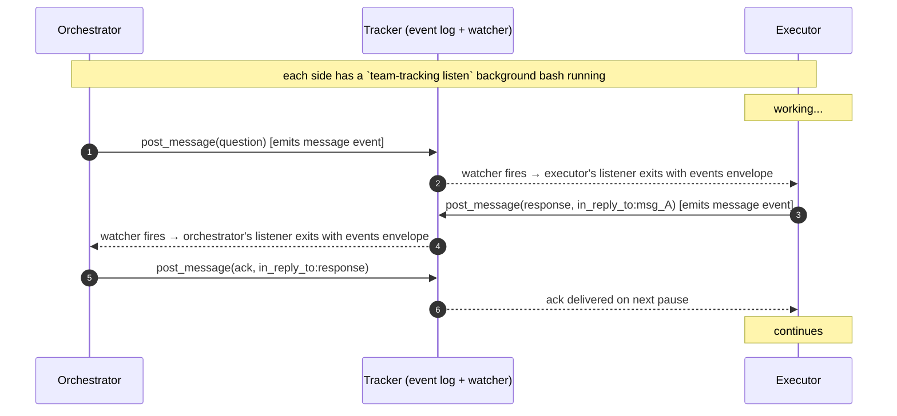

# team-tracking-orchestrate

You're the planner. You read the board, decide structure, and dispatch — you don't write code or hold locks. Lower-level tool reference: [`team-tracking-usage`](../team-tracking-usage/SKILL.md).

## Step 0 — read the board first

```
list_board(project)
```

The response is priority-ordered (`In Progress` → `Todo` → `Backlog`). Don't plan in a vacuum:

- `lock_state == "in_progress"` — a specialist is actively working. Don't create overlapping work.
- `lock_state == "committed"` — work is in flight with a checkpoint. If `lock.acquired_at` is past TTL, it's a crash; surface to the user before stealing the lock.
- `scope` — free-text conflict signal. If your new ticket touches the same module, sequence behind (or split that module out first).
- `branch` — code is already moving. Coordinate, don't duplicate.

## Column lifecycle

The board has five columns; the meaningful state machine is:

```
Backlog ──plan──► Todo ──lock acquired──► In Progress ──PR opened──► In Review ──merged──► Done
                                                                                              ▲
                          ┌───── auto-flip when every child is Done ──────────────────────────┘
```

- **Backlog** — Created. Not yet committed to plan. No subtasks attached.
- **Todo** — *Committed to plan.* The orchestrator has decomposed the ticket into pipeline subtasks and is about to dispatch. **You move it here yourself, before adding subtasks.** This is the cue the obsidian-kanban adapter uses to hoist non-leaf children onto the board as their own cards (so each child can be tracked through the columns independently).
- **In Progress** — Auto. Set when the first specialist `acquire_ticket`s — don't write it manually.
- **In Review** — Manual. Set when the PR is up. Specialist transitions on their own subtask via `release_ticket(..., final_status: "In Review")` once the PR is open.
- **Done** — Manual on the leaf, auto on the parent. Specialist sets their subtask to Done at merge. The adapter flips the parent (task) when all its subtasks are Done; the epic flips when all its tasks are Done; etc.

**The Backlog → Todo move is yours to make.** A common mistake (it bit a real session) is creating tickets, attaching subtasks, dispatching, and never promoting the parent — the board ends up with everything still in Backlog because you assumed something downstream would promote it. Nothing does.

```
update_ticket(epicRef,  { status: "Todo" })   // before adding child tasks
update_ticket(taskARef, { status: "Todo" })   // before adding child subtasks
update_ticket(taskBRef, { status: "Todo" })   // ditto
```

## Hierarchy

PRD shape → top-level type. The server enforces these parent rules.

| PRD shape | Top-level | Decompose into |
|---|---|---|
| Multi-slice feature | `epic` | stories |
| Single feature | `story` | tasks |
| One-off change | `task` | pipeline subtasks |

```
epic    parent: null
story   parent: epic | null
task    parent: story | epic | null
subtask parent: task | story
```

## Tasks **must** be decomposed

A task without subtasks is incomplete planning. Every task gets pipeline subtasks before dispatch.

| Stage | Required? | When to skip |
|---|---|---|
| Write tests | Optional (TDD opt-in) | Truly throwaway / unverifiable changes |
| Adversarial test review | Optional (only with tests) | Trivial test surfaces |
| **Implement** | **Required** | — |
| Spec compliance review | Optional | Self-contained UI tweaks where the spec is a Figma file |
| **Adversarial code review** | **Required (≥1)** | — |

Pick **more** stages (and multiple reviewers) for: auth, billing, migrations, public API changes, anything cross-cutting. Pick **fewer** for: self-contained UI, plumbing inside an existing pattern, spikes (often `investigate → write findings → peer review`).

## Priority

| | When |
|---|---|
| `P0` | Regression, data loss risk, security, or blocks the release |
| `P1` | On the critical path for the next sprint |
| `P2` | Default. Want-not-need: cleanup, polish, deferred |

Don't promote unless the constraint is real. Priority isn't a signaling tool — `lock_state` already tells specialists what's hot.

## Architect consultation

Consult an architect (human or skill) **before dispatching** when:

- The change spans modules you haven't worked in — ask "is the seam right?"
- The PRD leaves the impl shape ambiguous — get a decision before locking in subtasks
- A pipeline subtask threatens to grow beyond one specialist session

Where to look for architectural context, in order:
1. `architecture.md` inside the project's vault folder (the Obsidian adapter scaffolds this).
2. `ARCHITECTURE.md` / `CLAUDE.md` at the repo root.
3. The project's design doc.
4. If none of the above, surface the ambiguity to the user before dispatching anything.

## Dispatching

You don't acquire locks. The specialist does. Your handoff is:

1. Promote the parent to **Todo** (see "Column lifecycle"). Skipping this step is a common mistake.
2. Pick the specialist role for the subtask (implementer, test-writer, adversarial-test-reviewer, adversarial-code-reviewer, …).
3. Hand them the subtask's `TicketRef` plus a short brief: what "done" looks like, files in scope, links to spec, the parent task's body for context.
4. They run [`team-tracking-execute`](../team-tracking-execute/SKILL.md) — acquire → checkpoint → release. Acquiring the lock auto-flips the subtask to `In Progress`.
5. When they release as `Blocked`, read the ticket's `update` + `progress_summary` and decide: split further, reassign, or escalate to user/architect.

**How** you actually summon the specialist is host-specific — Claude Code's `Agent` tool, an external worker queue, a sub-agent CLI, an issue assignee in your tracker. This skill is agnostic to that mechanism. The only contract is: the specialist receives `TicketRef`, runs `team-tracking-execute`, and reports back via the events log.

## Supervising specialists in flight

Long-running specialists drift. They hallucinate (claim work that isn't in the diff), scope-creep (start touching files outside the subtask), or get stuck looping. You catch this through **two parallel signals**:

1. The push channel — a project-wide `team-tracking listen` background bash that wakes you on every event (message, checkpoint, progress, status change, lock change).
2. Periodic board sweeps — `list_board` every ~5 min for *anything that didn't generate an event* (e.g. a specialist that has gone silent for too long).

### The listener

When you have at least one specialist in flight, keep one background listener running per project:

```
Bash(
  team-tracking listen --project <P> --since <last_seen_at> --timeout-ms 300000,
  run_in_background: true
) → handle_orch
```

`last_seen_at` starts at the time you dispatched the first specialist; advance it to `max(events.map(e => e.at))` after each wake. The listener exits on:
- An `events` envelope — the harness surfaces the JSONL output to you on the next turn. Process the events, post any responses, re-spawn the listener.
- `timeout` — the 5-min refresh. Just re-spawn with the new cursor; not a failure signal.
- `error` — log it, surface to the user if it persists, re-spawn.

This replaces the old "poll every 5–10 min" cadence. The listener delivers everything that flows through the event log without a single extra read call.

### Open-question bookkeeping (orchestrator-side)

When you `post_message(kind="question")`, record `{message_id, ticket_ref, at, sla_ms = 180_000}` in your own working memory. On every listener wake, check open questions whose deadline has passed without a matching `in_reply_to` response — that's when to nudge:

```
post_message(ref, {
  from: "orchestrator",
  kind: "nudge",
  body: "Still waiting on your take on the retry path. Stuck or just deep?",
})
```

A 5-min subscription timeout is **not** the same as an unanswered question. Don't ping a healthy worker just because the channel was quiet for 5 min — only when a question you actually asked is past its SLA.

### Periodic sweeps for liveness

Every ~5 min while specialists are in flight, also call `list_board(project)` and inspect any ticket where `lock_state ∈ {in_progress, committed}` for staleness:

```
last_activity = max(lock.acquired_at, lock.last_checkpoint?.at)
age           = now - last_activity
```

| Age | Interpretation | Action |
|---|---|---|
| < 5 min | Healthy | Move on |
| 5–15 min | Normal for non-trivial work | Confirm `update` / `progress_summary` track the spec |
| 15–30 min | Concerning | Inspect the last checkpoint's diff. If on-spec, give it room. If drifting, prepare a corrective dispatch |
| > TTL (default 30 min) | Stale lock | Lock is recoverable. Re-acquire to claim `recovered_checkpoint` and re-dispatch |

For any ticket with `lock_state == "committed"`, **inspect the actual diff** of the last checkpoint:

```bash
git show <lock.last_checkpoint.commit_id>
```

The board tells you what the specialist *says* it did; the diff tells you what it actually did. They don't always agree — that's the whole reason to look.

### Drift signals

Reading `update`, `progress_summary`, the recent commit's diff, and the event log via `read_events(ref, { types: ["progress", "checkpoint"] })`:

- **Scope creep** — `progress_summary` mentions modules, files, or behaviors outside the subtask spec. The diff confirms files outside the expected scope changed. Note it; budget extra time for the adversarial code review to flag it.
- **Hallucination** — the summary claims work that isn't in the diff (e.g. "added integration tests for X" but no test files appear). Don't trust the visible fields; trust the diff.
- **Stuck loop** — multiple consecutive `progress` events with the same `progress_summary` and no new `checkpoint`. The specialist is spinning. Try a nudge; if the next event is still spinning, plan to recover via TTL.

### Steering cycle (orchestrator ↔ executor)



Round-trip target: **under 1 min** of wall time. Bounded by each side's in-flight tool call duration when the message arrives.

### Corrective levers — the steering channel

```
post_message(ref, {
  from: "orchestrator",
  kind: "nudge" | "question",
  body: "Stay within auth/ — billing/ is out of scope.",
})
→ { id: "msg_abc...", at: "2026-04-25T10:30:00Z" }
```

What `kind` to use:
- `nudge` — directional ("stay in scope X", "stop adding tests"). Executor ACKs.
- `question` — answer expected ("what blocked the retry path?"). Executor responds. Track in your open-question bookkeeping above.

If a question goes 10+ min without a reply: the executor is either deep in a long tool call or stuck. Re-read its last checkpoint diff. If drifting, prepare a corrective dispatch; if still apparently working, give one more cycle before considering recovery.

### When the channel isn't enough

1. **Wait out the TTL** — if the specialist is unresponsive (no new checkpoint past TTL, no message reply), the lock becomes recoverable. `acquire_ticket` returns the prior `recovered_checkpoint` and you can re-dispatch with corrective context.
2. **Surface to the user / architect** — when drift is consequential (data loss, time pressure, architectural mistake), don't quietly absorb it. Post a `question` *and* surface to a human in parallel.

What you should **not** do:

- Don't force-acquire a non-stale lock. The lock contract protects in-flight work; bypassing it corrupts state.
- Don't update or rewrite the subtask's body / status while the specialist holds the lock — they may rely on those fields.
- Don't keep the listener cursor stuck on an old `since`. After every wake, advance to `max(events.map(e => e.at))` so the broker doesn't redeliver history.
- Don't post a message every few minutes "just to check." The steering channel is for substantive guidance; flooding it makes specialists ignore it.

## Watching for blocked / completed

The push listener delivers `status_change` events for `Blocked` and `Done` transitions automatically. Periodic `list_board` sweeps still serve as a safety net:
- `Blocked` tickets — read `progress_summary` (the executor wrote you a briefing) and act: split, reassign, or surface to the user.
- Stale `committed` locks past TTL with the same checkpoint for too long — likely crashed; recover via re-acquire.
- Newly `Done` subtasks — dispatch the next pipeline stage if there is one.

## Red flags

- **Don't create a task without subtasks.** A bare task is half-done planning.
- **Don't acquire locks.** That's the specialist's job.
- **Don't promote `Todo` → `In Progress` yourself.** It happens automatically when a specialist acquires the lock.
- **Don't forget `Backlog` → `Todo`.** That promotion *is* yours — it's the signal that you've decomposed the ticket and the children are ready to be picked up. Forgetting it leaves the whole tree marooned in Backlog.
- **Don't manually set a parent to `Done`.** Set the leaf subtask to `Done`; the adapter rolls the parent up when every sibling is also Done. Manual sets diverge from rollup state.
- **Don't reuse `scope` strings inconsistently.** Pick a vocabulary (typically module/package names) and stick to it.
- **Don't dispatch a task whose subtasks contradict each other.** Re-read the spec when in doubt.
