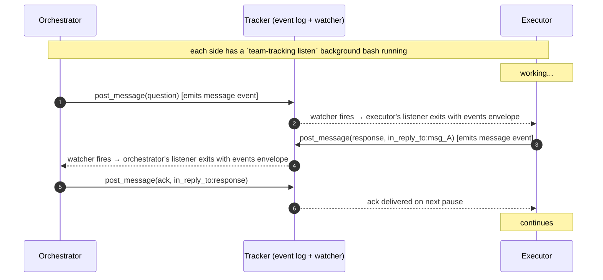

# team-tracking-supervise

You're the supervisor. Specialists are running; your job is to catch drift early, answer their questions, and recover stalled work. You **don't** plan new work in this skill ([`team-tracking-plan`](../team-tracking-plan/SKILL.md) is for that), and you **don't** acquire locks ([`team-tracking-execute`](../team-tracking-execute/SKILL.md) is for that).

Lower-level tool reference: [`team-tracking-usage`](../team-tracking-usage/SKILL.md).

## Two parallel signals

Long-running specialists drift. They hallucinate (claim work that isn't in the diff), scope-creep (start touching files outside the subtask), or get stuck looping. You catch this through **two parallel signals**:

1. **The push channel** — a project-wide `team-tracking listen` background bash that wakes you on every event (message, checkpoint, progress, status change, lock change).
2. **Periodic board sweeps** — `list_board` every ~5 min for *anything that didn't generate an event* (e.g. a specialist that has gone silent for too long).

## The listener

When you have at least one specialist in flight, keep one background listener running per project:

```
Bash(
  team-tracking listen --project <P> --since <last_seen_at> --timeout-ms 300000,
  run_in_background: true
) → handle_orch
```

`last_seen_at` starts at the time you dispatched the first specialist; advance it to `max(events.map(e => e.at))` after each wake. The listener exits on:
- An `events` envelope — the harness surfaces the JSONL output to you on the next turn. Process the events, post any responses, re-spawn the listener.
- `timeout` — the 5-min refresh. Just re-spawn with the new cursor; not a failure signal.
- `error` — log it, surface to the user if it persists, re-spawn.

This replaces the old "poll every 5–10 min" cadence. The listener delivers everything that flows through the event log without a single extra read call.

## Open-question bookkeeping

When you `post_message(kind="question")`, record `{message_id, ticket_ref, at, sla_ms = 180_000}` in your own working memory. On every listener wake, check open questions whose deadline has passed without a matching `in_reply_to` response — that's when to nudge:

```
post_message(ref, {
  from: "orchestrator",
  kind: "nudge",
  body: "Still waiting on your take on the retry path. Stuck or just deep?",
})
```

A 5-min subscription timeout is **not** the same as an unanswered question. Don't ping a healthy worker just because the channel was quiet for 5 min — only when a question you actually asked is past its SLA.

## Periodic sweeps for liveness

Every ~5 min while specialists are in flight, also call `list_board(project)` and inspect any ticket where `lock_state ∈ {in_progress, committed}` for staleness:

```
last_activity = max(lock.acquired_at, lock.last_checkpoint?.at)
age           = now - last_activity
```

| Age | Interpretation | Action |
|---|---|---|
| < 5 min | Healthy | Move on |
| 5–15 min | Normal for non-trivial work | Confirm `update` / `progress_summary` track the spec |
| 15–30 min | Concerning | Inspect the last checkpoint's diff. If on-spec, give it room. If drifting, prepare a corrective dispatch |
| > TTL (default 30 min) | Stale lock | Lock is recoverable. Re-acquire to claim `recovered_checkpoint` and re-dispatch |

For any ticket with `lock_state == "committed"`, **inspect the actual diff** of the last checkpoint:

```bash
git show <lock.last_checkpoint.commit_id>
```

The board tells you what the specialist *says* it did; the diff tells you what it actually did. They don't always agree — that's the whole reason to look.

## Drift signals

Reading `update`, `progress_summary`, the recent commit's diff, and the event log via `read_events(ref, { types: ["progress", "checkpoint"] })`:

- **Scope creep** — `progress_summary` mentions modules, files, or behaviors outside the subtask spec. The diff confirms files outside the expected scope changed. Note it; budget extra time for the adversarial code review to flag it.
- **Hallucination** — the summary claims work that isn't in the diff (e.g. "added integration tests for X" but no test files appear). Don't trust the visible fields; trust the diff.
- **Stuck loop** — multiple consecutive `progress` events with the same `progress_summary` and no new `checkpoint`. The specialist is spinning. Try a nudge; if the next event is still spinning, plan to recover via TTL.

## Steering cycle (orchestrator ↔ executor)



Round-trip target: **under 1 min** of wall time. Bounded by each side's in-flight tool call duration when the message arrives.

## Corrective levers — the steering channel

```
post_message(ref, {
  from: "orchestrator",
  kind: "nudge" | "question",
  body: "Stay within auth/ — billing/ is out of scope.",
})
→ { id: "msg_abc...", at: "2026-04-25T10:30:00Z" }
```

What `kind` to use:
- `nudge` — directional ("stay in scope X", "stop adding tests"). Executor ACKs.
- `question` — answer expected ("what blocked the retry path?"). Executor responds. Track in your open-question bookkeeping above.

If a question goes 10+ min without a reply: the executor is either deep in a long tool call or stuck. Re-read its last checkpoint diff. If drifting, prepare a corrective dispatch; if still apparently working, give one more cycle before considering recovery.

## When the channel isn't enough

1. **Wait out the TTL** — if the specialist is unresponsive (no new checkpoint past TTL, no message reply), the lock becomes recoverable. `acquire_ticket` returns the prior `recovered_checkpoint` and you can re-dispatch with corrective context.
2. **Surface to the user / architect** — when drift is consequential (data loss, time pressure, architectural mistake), don't quietly absorb it. Post a `question` *and* surface to a human in parallel.

## Watching for blocked / completed

The push listener delivers `status_change` events for `Blocked` and `Done` transitions automatically. Periodic `list_board` sweeps still serve as a safety net:
- `Blocked` tickets — read `progress_summary` (the executor wrote you a briefing) and act: split, reassign, or surface to the user.
- Stale `committed` locks past TTL with the same checkpoint for too long — likely crashed; recover via re-acquire.
- Newly `Done` subtasks — return to [`team-tracking-plan`](../team-tracking-plan/SKILL.md) to dispatch the next pipeline stage if there is one.

## Red flags

- **Don't force-acquire a non-stale lock.** The lock contract protects in-flight work; bypassing it corrupts state.
- **Don't update or rewrite the subtask's body / status while the specialist holds the lock** — they may rely on those fields.
- **Don't keep the listener cursor stuck on an old `since`.** After every wake, advance to `max(events.map(e => e.at))` so the broker doesn't redeliver history.
- **Don't post a message every few minutes "just to check."** The steering channel is for substantive guidance; flooding it makes specialists ignore it.
- **Don't promote `Todo` → `In Progress` yourself.** It happens automatically when a specialist acquires the lock.
